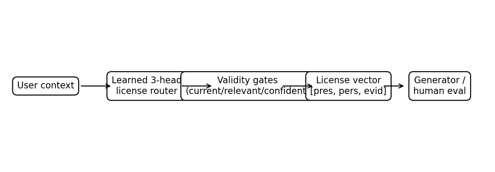

# Personalized, Not Persuaded: Learning When Personal Context Counts as Evidence

**Aura Yavary**

## Abstract
Personalized assistants consume heterogeneous user context: stated preferences, inferred habits, remembered facts, tool outputs, third-party messages, and external records. These signals are not epistemically interchangeable. A preference can be useful for ranking recommendations without being evidence for a factual claim; a connected calendar event can be legitimate evidence for a personal-state query; a confident user assertion about the world should not become true because it appears in memory. We formulate this distinction as **evidentiary standing**: for a given task, each context signal has separate permission to influence presentation, personalized decision-making, or the epistemic answer. We operationalize standing with **Provenance-Licensed Personalization (PLP)**, a three-head router conditioned on task, scope, provenance, confidence, currentness, and relevance. We introduce **ProvenanceBench**, a controlled benchmark with 4,800 signal-level examples spanning in-distribution, held-out-domain, compositional, and conflicting-evidence tests. A learned three-head router fits the ordinary held-out split but fails sharply under compositional shift, leaking unsupported evidence on the held-out conjunctions. We therefore introduce **Hybrid PLP**, which combines learned licensing with three narrow validity gates: stale, low-confidence, and task-irrelevant context cannot receive a license. Hybrid PLP improves robustness on held-out domains and compositional validity shifts, but does not fully solve evidence uptake: it reaches 0.947 exact match on domain OOD and 0.800 on the compositional split. A paired provenance-intervention test, which holds task and surface text fixed while changing only source metadata, exposes a complementary limitation: Hybrid PLP reaches 0.750 exact match, while a provenance-only oracle-like rule reaches 1.000 and a model with provenance removed falls to 0.500. The benchmark therefore separates source sensitivity from broader task validity rather than allowing either to masquerade as the other. We separate **licensing quality** from downstream **generation compliance**, and provide a blinded 552-item human-validation packet and model-adapter harness for the external experiments needed to establish end-to-end language-model gains. The results support a narrower claim than frontier-model improvement: provenance-conditioned licensing is learnable, naive learned routing is compositionally brittle, and explicit validity constraints can remove a concrete failure mode without reverting to a blanket firewall.

## 1. Introduction
A useful personal assistant should adapt to the user. It should remember that the user prefers concise answers, that a meeting was moved, that a food restriction applies to restaurant suggestions, and that a connected booking confirms a departure time. But personalization creates a standing problem: **when is user context merely relevant, and what is it actually allowed to change?**

Provenance and relevance are not enough on their own. Provenance identifies where a signal came from; relevance identifies whether it concerns the current task. **Evidentiary standing** is the task-conditioned permission for that signal to influence the epistemic answer. A context item may have presentation or personalization standing without having evidentiary standing.

Provenance identifies where context came from and relevance identifies whether it concerns the current task; neither alone determines permitted influence. We call that task-conditioned permission **standing**.

This distinction is easy to blur. Interaction histories and memory profiles can increase sycophancy in deployed language models, while factuality-preserving personalization methods have shown that personal context can distort factual reasoning. At the same time, a system that categorically blocks user memory from the epistemic path is not a useful personal assistant: personal facts and trusted tool outputs are often exactly the evidence needed to answer the user's question.

The resulting design problem is symmetric. An assistant can fail by **unsupported influence leakage**—treating an unverified belief, stale memory, or irrelevant context as evidence. It can also fail by **evidence starvation**—refusing to use context that is both relevant and sufficiently grounded. Existing work largely attacks one side of this tension: sycophancy mitigation, factuality-preserving personalization, cautious context steering, or general resistance to non-evidential pressure. We instead make the *license to influence* explicit and task-conditioned.

We define each user-context signal by its content, scope, provenance, currentness, confidence, and relevance to the current task. A PLP policy predicts three binary licenses: whether the signal may influence (i) presentation, (ii) personalization, and (iii) epistemic evidence. This factorization matters because the same signal may be allowed to shape one channel while forbidden from another. "I prefer short answers" may affect presentation; "I dislike seafood" may affect a recommendation; a tool-confirmed booking may affect an answer about the user's itinerary; "I think company X is fraudulent" should not by itself establish a world fact.

We make four contributions. First, we formalize persistent personal context as a **multi-channel standing problem** rather than a single context-on/context-off decision. Second, we introduce ProvenanceBench, with ordinary held-out, domain-OOD, compositional, and conflicting-evidence evaluations. Third, we show an instructive negative result: a learned license router performs well on standard held-out data but fails on unseen conjunctions of stale, low-confidence, and irrelevant evidence. Fourth, we introduce Hybrid PLP, which combines the learned router with three simple validity constraints and closes that specific compositional failure in the controlled benchmark.

The empirical boundary is important. ProvenanceBench is a contract benchmark, not a frontier-model evaluation. Its purpose is to identify whether a licensing policy has learned the intended distinction before integrating it into generation. End-to-end model compliance, human validity, and comparisons on external personalization benchmarks remain separate experiments; we provide the harness and blinded annotation packet but do not report uncollected evidence.

## 2. Related Work
### Personalization and factual distortion
Sun et al. introduce PFQABench and Factuality-Preserving Personalized Steering (FPPS), showing that personalization can entangle user history with factual representations and induce hallucinations. FPPS is an important nearest neighbor because it explicitly aims to preserve factuality while retaining personalized behavior. Our focus differs in the unit of control: rather than steering factual representations globally, PLP assigns **signal-level, task-conditioned licenses** and explicitly distinguishes evidence starvation from unsupported influence.

Cautious Context Steering (CCS) learns token-level control over how strongly user context should affect generation and reports generalization to unseen users and domains. PLP is complementary: CCS asks *how much* context should influence generation, whereas PLP asks *which semantic channel* a context signal is permitted to influence and whether it is licensed as evidence.

### Context, memory, and sycophancy
Jain et al. show that realistic interaction context and user memory profiles can increase agreement sycophancy for multiple models. This motivates evaluating personalization in the presence of persistent context rather than treating sycophancy as a zero-shot property. Our benchmark isolates a narrower mechanism: the evidentiary status of a context signal.

HorizonBench studies evolving preferences over long histories and provides provenance for preference changes. That work establishes long-horizon state tracking as a major bottleneck. PLP addresses a different question: even if a system retrieves the right memory, should that memory be allowed to alter a factual answer?

### Provenance-aware personal memory
QUMem, MemORAI, and Agent Zero Memory show that modern personal-agent memory already tracks provenance, temporal validity, typed state, and query-conditioned relevance. Those systems narrow the novelty available on the memory side. Our target is downstream of retrieval: once a context item is available, what standing does it have to alter presentation, personalized decisions, or the epistemic answer?

### Resist versus update
Resist and Update frames reliable reporting as a causal contract: reports should be invariant to forbidden influences but responsive to licensed evidence. This is the closest conceptual precedent to our evidence channel. PLP specializes the contract to persistent personal context and separates presentation, personalization, and evidentiary licenses. The benchmark also includes personal-state queries, preference/constraint signals, stale memories, and conflicting sources rather than only report-level incentive pressure. We do not claim that the high-level resist/update principle is new.

### Personalized reward models
Personalized RewardBench demonstrates that reward models struggle to capture user-specific preference while preserving general response quality, and validates benchmark utility against downstream Best-of-N and PPO behavior. This motivates our insistence on separating benchmark diagnostics from downstream claims: licensing accuracy alone does not establish that a generator will obey the license.

## 3. Provenance-Licensed Personalization
Let a context signal be

\[
z_i=(c_i,s_i,p_i,q_i,u_i,r_i),
\]

where \(c_i\) is content, \(s_i\) is semantic scope, \(p_i\) is provenance, \(q_i\) is confidence, \(u_i\) is currentness, and \(r_i\) is relevance to task \(t\). We define the task-conditioned **standing function**

\[
S(z_i,t)=(s_i^{\text{pres}},s_i^{\text{pers}},s_i^{\text{evid}})\in\{0,1\}^3.
\]

The three standing channels correspond to presentation, personalization, and epistemic evidence. PLP is the learned implementation of this standing function. Their separation prevents a common shortcut: treating "context is useful" as equivalent to "context is evidence."

### 3.1 Learned license head
Our learned router uses signal text together with structured scope, provenance, task kind, confidence, currentness, and relevance. Three independent logistic heads predict presentation, personalization, and evidence licenses. Decision thresholds are selected on a validation split only.

This model is intentionally lightweight. The question is not whether a large encoder can memorize the contract, but whether the benchmark exposes the distinctions and whether the learned rule generalizes across domains and compositions.

### 3.2 Hybrid validity constraints
The pure learned router reveals a compositional failure: it learns that verified sources are usually evidentiary, but does not reliably generalize to held-out conjunctions in which otherwise trusted evidence is stale, low-confidence, or task-irrelevant. Hybrid PLP therefore applies three post-prediction validity gates:

\[
(u_i=0)\lor(q_i<\tau_q)\lor(r_i=0) \Rightarrow L(z_i,t)=(0,0,0).
\]

The learned model still decides the semantic and provenance-sensitive cases; the gate only enforces basic validity conditions. This is closer to production policy design than a fully hard-coded router: learned behavior handles the open-ended mapping, while a small number of high-confidence invariants are explicit.

### 3.3 Licensing is not generation compliance
PLP produces a policy over context. A downstream generator can still ignore the license or leak blocked context. We therefore decompose end-to-end success into two terms:

1. **License inference:** did the router assign the intended channel permissions?
2. **License compliance:** did generation use only permitted context in each channel?

This paper evaluates the first term. The repository contains an adapter interface for the second.

## 4. ProvenanceBench
ProvenanceBench contains 4,800 signal-level examples across eight application domains, including travel, calendar, commerce, work, finance, health/wellness, education, and local-life tasks. The benchmark is generated from explicit contract archetypes, then instantiated with domain-specific language.

### 4.1 Splits
The benchmark uses four evaluation regimes:

**Standard held-out.** Same domains and contract families as training, but unseen items.

**Domain OOD.** Finance and education are never used to fit the learned router.

**Compositional.** Specific conjunctions are withheld from training: stale trusted evidence, low-confidence trusted evidence, irrelevant trusted evidence, and two positive task/provenance combinations. This split tests whether the router learns factorized validity rather than memorizing common provenance-task pairs.

**Conflicting evidence.** Groups contain multiple candidate sources for the same personal-state query: explicit user memory, a connected tool, an external primary source, and a third-party message. A separate learned ranker selects the preferred source; freshness can cause an otherwise authoritative source to lose.

### 4.2 Human-validation packet
We construct a 552-item blinded packet sampled across standard, OOD, and compositional conditions. The packet exposes task and context metadata but hides gold labels. Three independent raters per item are recommended, with Krippendorff's alpha reported separately for each license dimension. No human labels are claimed in the present results.

### 4.4 Construction and split discipline

The 4,800 examples are balanced across eight domains (600 each). The main router uses 1,680 training and 168 validation examples, with 168 ordinary held-out examples, 912 domain-OOD examples, and 720 compositional examples. Conflict selection is evaluated separately because choosing among multiple licensed sources is a different decision from determining whether an individual source is licensed at all.

### 4.5 Paired provenance intervention

A separate 400-pair (800-example) intervention holds task, scope, confidence, currentness, relevance, and surface text fixed; only provenance metadata changes. It is never used for training or threshold selection.

### 4.3 Metrics
We report:

- **Exact license match:** all three license bits are correct.
- **Licensed evidence uptake:** fraction of licensed evidence accepted.
- **Unsupported influence leakage:** fraction of non-evidence incorrectly admitted to the evidentiary channel.
- **Evidence starvation:** one minus licensed evidence uptake.
- **Conflict selection accuracy:** fraction of conflict groups where the preferred evidence source is selected.

The raw dimensions are primary; no single scalar is used to hide the leakage/starvation tradeoff.

## 5. Experiments
### 5.1 Baselines
We compare against four controlled baselines.

**Naive personalization** admits explicit, tool-verified, and externally verified personal/world context as evidence with minimal task conditioning.

**Fixed firewall** blocks all evidentiary use, eliminating leakage at the cost of evidence starvation.

**Provenance-only** trusts tool/external provenance but ignores currentness, confidence, and some task-specific constraints.

**Oracle** uses the benchmark contract directly and provides an upper bound for license inference, not a deployable method.

We also report the pure learned router and Hybrid PLP.

### 5.1 Training protocol

Each license head is a class-balanced logistic classifier over TF-IDF signal text, one-hot categorical metadata, and standardized confidence/currentness/relevance features. Binary thresholds are selected only on validation. Ten solver random states produce identical aggregate metrics, so the reported shift failures are not initialization artifacts of the linear model.

### 5.2 Main licensing results

| Method | ID exact | OOD exact | Compositional exact | OOD evidence uptake | OOD leakage |
|---|---:|---:|---:|---:|---:|
| Naive personalization | 0.286 | 0.368 | 0.600 | 1.000 | 0.857 |
| Fixed firewall | 0.571 | 0.526 | 0.400 | 0.000 | 0.000 |
| Provenance-only | 0.714 | 0.684 | 0.600 | 0.800 | 0.071 |
| Learned PLP | **1.000** | 0.842 | 0.400 | **0.800** | 0.143 |
| **Hybrid PLP** | **1.000** | **0.947** | **0.800** | **0.800** | **0.000** |
| Oracle | 1.000 | 1.000 | 1.000 | 1.000 | 0.000 |

The ordinary held-out split is easy for the learned model. Under domain OOD, the pure learned router drops to 0.842 exact match and both leaks unsupported evidence and misses licensed evidence. Hybrid PLP removes the measured leakage but still starves 20% of licensed evidence, reaching 0.947 exact match. On the compositional split, Hybrid PLP improves over the pure learned router (0.800 vs. 0.400) by blocking invalid context, but it cannot recover positive evidence permissions the learned router failed to predict. This asymmetry is important: negative validity gates are robust filters, not a complete evidence-acquisition mechanism.

The comparison with provenance-only is paired at the item level. On domain OOD, Hybrid PLP is uniquely correct on 288 cases while provenance-only is uniquely correct on 48 (paired exact test, \(p<10^{-14}\)); on the compositional split the discordant counts are 288 versus 144 (\(p<10^{-11}\)). The advantage is therefore real on these controlled instances but not absolute. Item-bootstrap uncertainty gives 0.947 [0.933, 0.962] exact match for Hybrid PLP on domain OOD and 0.800 [0.771, 0.828] on the compositional split.

### 5.3 Ablations
Removing provenance from the learned input lowers evidence-license performance, while text-only models perform substantially worse on personalization and evidence decisions. More importantly, removing the hybrid validity gate recovers the pure learned router's compositional failure. The gate therefore contributes something not learned robustly from ordinary supervised examples.

This result argues for a hybrid design, not for a universal rule that all validity constraints must be hard-coded. The three gates were selected because they have clear semantics and can be audited. A larger system should justify each hard constraint separately.

### 5.4 Conflicting evidence
A separately learned evidence ranker reaches 1.00 selection accuracy on 48 held-out conflict groups and 72 groups from held-out domains. This task remains controlled: source authority and freshness are represented explicitly. The result demonstrates that the benchmark can express "use evidence, but prefer the newer/more authoritative source" rather than only binary allow/block behavior.

## 6. Analysis
### 6.1 Why pure supervised licensing fails
The pure learned router sees many examples where trusted provenance correlates with evidence. On the compositional split, it must apply independent validity concepts—staleness, confidence, relevance—to trusted sources in combinations withheld from training. Its failure is a concrete example of shortcut learning: high-quality provenance becomes a proxy for evidentiary permission.

The hybrid gate changes the inductive bias. Instead of asking the learned head to rediscover every invariant from combinations of examples, it reserves a small set of validity conditions for explicit policy. The pattern mirrors a broader systems principle: learn what is ambiguous; encode what is intentionally invariant.

### 6.2 Leakage versus starvation
Naive personalization illustrates leakage: it uses all licensed evidence but admits unsupported context. The firewall illustrates starvation: it eliminates leakage by rejecting all evidence. Provenance-only sits between them but still fails when provenance is insufficient to establish relevance or currentness. Reporting only accuracy would obscure these qualitatively different errors.

### 6.3 Provenance intervention reveals a different failure mode

To test provenance causally rather than correlationally, we add 400 matched pairs (800 examples) in which task, scope, confidence, currentness, relevance, and surface text are identical; only the provenance metadata changes between a licensed and unlicensed source. A strict no-provenance model therefore cannot distinguish the two members of a pair and attains 0.500 exact match. Learned and Hybrid PLP reach 0.750, showing genuine source sensitivity but incomplete transfer to the delexicalized setting. The provenance-only rule reaches 1.000 on this deliberately narrow test. This is not a contradiction: the intervention isolates one dimension on which an explicit provenance rule is sufficient, whereas the broader benchmark requires joint reasoning over provenance, scope, task relevance, freshness, and confidence.

The paired intervention prevents a misleading conclusion from the standard benchmark alone: good OOD performance does not prove that a learned router uses provenance for the right causal reason.

## 7. Limitations and Next Experiments
The central limitation is external validity. ProvenanceBench is generated from contract archetypes, not collected from deployed assistants. The user-context text is naturalistic but controlled. Human validation has been prepared but not collected. Most importantly, we do not report end-to-end outputs from frontier or open-weight language models.

A publication-level model-behavior study should freeze the benchmark and run the same licensing interventions with real generators. The strongest next comparison is not another local proxy, but a head-to-head evaluation against full-context prompting, retrieval/memory baselines, FPPS-style factuality preservation, cautious context steering, and a Resist-and-Update-inspired report-level control. The oracle license should also be fed to the generator to separate router error from compliance error.

A second limitation is provenance availability. Real systems often do not receive perfect provenance metadata. Future work should infer provenance from tool traces and memory stores, quantify provenance uncertainty, and evaluate attacks in which untrusted content masquerades as a trusted source.

A third limitation is temporal authority. Conflicting evidence can require domain-specific rules: an airline API may supersede a calendar event, while a user's explicit correction may supersede an old tool snapshot. Our conflict benchmark encodes a simple authority/freshness ordering and should be extended to learned task-specific source reliability.

## 8. Conclusion
Personalization should not be a single scalar controlling how strongly a model mirrors the user. User context can be relevant for style, useful for decisions, and still unlicensed as evidence. Provenance-Licensed Personalization makes that distinction explicit. On a controlled benchmark, a learned license router performs well on ordinary held-out data but fails under compositional shift; a hybrid method that preserves three auditable validity constraints closes that failure without falling back to a blanket firewall. The result is deliberately modest: we establish a learnable and falsifiable interface for context licensing, not an end-to-end frontier-model improvement. That interface creates a concrete target for the next experiment—whether personal agents can adapt more deeply to users while keeping the provenance of belief updates under control.

## References
- Gihoon Kim, Jeyoung Lee, Suhan Woo, Sekwon Oh, Minsu Jeon, Hyounsoo Han, and Euntai Kim. *Cautious Context Steering for Language Model Personalization*. arXiv:2608.05813, 2026.
- Shomik Jain, Charlotte Park, Matt Viana, Ashia Wilson, and Dana Calacci. *Interaction Context Often Increases Sycophancy in LLMs*. CHI, 2026.
- Qiyao Ma, Dechen Gao, Rui Cai, Boqi Zhao, Hanchu Zhou, Junshan Zhang, and Zhe Zhao. *Personalized RewardBench: Evaluating Reward Models with Human Aligned Personalization*. arXiv:2604.07343, 2026.
- Shuyue Stella Li, Bhargavi Paranjape, Kerem Oktar, Zhongyao Ma, Gelin Zhou, Lin Guan, Na Zhang, Sem Park, Lin Chen, Diyi Yang, Yulia Tsvetkov, and Asli Celikyilmaz. *HorizonBench: Long-Horizon Personalization with Evolving Preferences*. arXiv:2604.17283, 2026.
- Zhongxiang Sun, Yi Zhan, Chenglei Shen, Weijie Yu, Xiao Zhang, Ming He, and Jun Xu. *When Personalization Misleads: Understanding and Mitigating Hallucinations in Personalized LLMs*. Findings of ACL, 2026.
- Sen Yang and Yuen-Hei Yeung. *Resist and Update: Counterfactual Report Coordinates for Incentive-Compatible LLMs*. arXiv:2607.12985, 2026.

- Heng Wang et al. *QUMem: Personalized Memory for Query-Conditioned User-State Inference in LLM Agents*. arXiv:2608.16168, 2026.
- Hung Pham Van et al. *MemORAI: Memory Organization and Retrieval via Adaptive Graph Intelligence for LLM Conversational Agents*. Findings of ACL, 2026.
- Ming Wu and Pengyuan Zhu. *Agent Zero Memory: Provenance-Aware Long-Term Memory for LLM Agents*. arXiv:2608.29606, 2026.